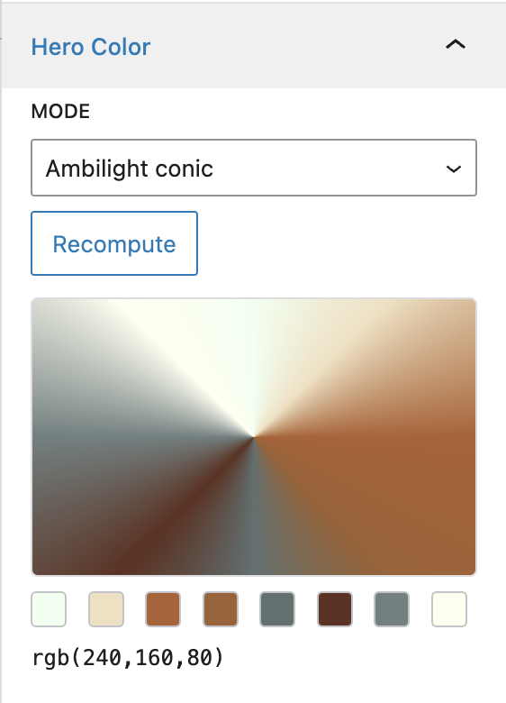
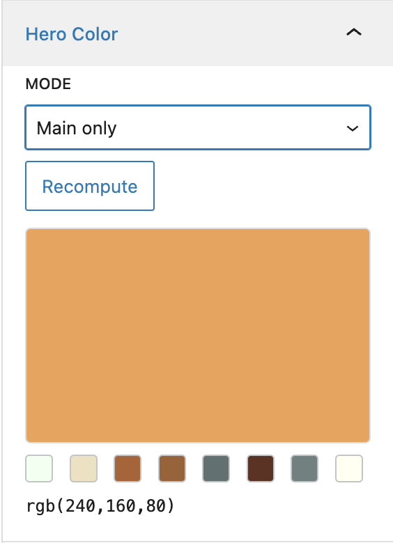
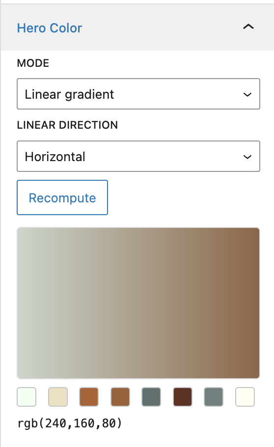

# WP Hero Color

WordPress plugin to compute deterministic hero colors from featured images and apply them as solid or gradient backgrounds.


## Preview

Editor panel preview samples:





## Modes

- `solid` (main dominant color)
- `linear` (edge-averaged gradient with selectable direction)
- `conic` (ambilight-style conic gradient using 8 edge colors)

## How to install

This plugin is **not** on the WordPress.org directory. Install it in one of these ways:

### From a GitHub Release (recommended)

When [GitHub Releases](https://github.com/srescio/wp-hero-color/releases) are published, a **Build release ZIP** workflow attaches a ready-to-upload archive named `wp-hero-color-<tag>.zip` with a stable top-level folder `wp-hero-color/`. Use **Plugins → Add New → Upload Plugin** in wp-admin, or unzip into `wp-content/plugins/`.

> **Note:** There may be no release assets yet; the automation lives in `.github/workflows/release-zip.yml`. Until the first release exists, use “from source” below or run the workflow manually (see below).

### From source

Clone or download the repository and copy the project into `wp-content/plugins/wp-hero-color/` (the folder name must be `wp-hero-color` so WordPress loads `wp-hero-color.php`).

### When the ZIP is built (not on PR merge)

The ZIP workflow does **not** run automatically when a PR is merged. It runs only when:

1. **Someone publishes a GitHub Release** — event `release: published`. The job checks out the **release tag** (not the default branch), builds the ZIP, and uploads it to that release as an asset.
2. **Someone runs “Build release ZIP” manually** from the **Actions** tab (`workflow_dispatch`) — useful to verify packaging; the ZIP is stored as a **workflow artifact** (filename uses `dev-<short-sha>`), not attached to a release.

Typical flow: merge to your mainline branch → create a **git tag** (for example `v0.1.0`) on the commit you want to ship → open **Releases → Draft a new release**, choose that tag, **Publish release** → download the attached ZIP.

## Data model

The plugin stores one **JSON string** in post meta key `_sr_hero_bg` (registered for the REST API and Polylang meta copy). The document is normalized on save; unknown fields are dropped.

| Field | Type | Meaning |
|-------|------|---------|
| `v` | int | Payload schema version (currently `1`). |
| `main` | string | Dominant color as `rgb(r,g,b)` from the central region of a downscaled copy of the featured image. |
| `edges` | string[] | Eight colors in fixed order: `tl`, `t`, `tr`, `r`, `br`, `b`, `bl`, `l` — each `rgb(r,g,b)` sampled from bands near the image edges. |
| `mode` | string | `solid` \| `linear` \| `conic` — how the frontend builds background CSS from `main` and `edges`. |
| `linear_dir` | string | For `linear` and `conic`: `vertical` \| `horizontal` \| `diag_tl_br` \| `diag_tr_bl` (ignored for `solid` in practice). |
| `attachment_id` | int | Featured image attachment ID used for the last successful compute (0 if unknown). |
| `updated_at` | string | ISO-8601 timestamp (UTC) of the last compute. |

**Consumers:** the block editor panel, classic meta box, REST `compute` / `post/{id}`, WP-CLI, bulk admin form, and `set_post_thumbnail` all read or write this meta. The public helper `wp_hero_color_get_attributes( $post_id )` maps the payload to HTML attributes and an inline `style` for themes.

## How it works

1. **Input** — The compute path resolves the featured image (or an explicit `attachment_id` over REST), then reads the file from disk with PHP (`get_attached_file` + `file_get_contents`).

2. **Decode and resize** — The bytes are decoded with **PHP GD** (`imagecreatefromstring`). Wide images are downscaled (long edge about 320px) with `imagecopyresampled` so work stays bounded.

3. **Sampling** — A band inset from the edges defines a “center” rectangle; the most frequent RGB bucket there becomes `main`. Eight outer regions map to `edges` (same bucketing logic, skipping near-black and near-white noise).

4. **Output** — Results are JSON-encoded into `_sr_hero_bg`. CSS for the hero wrapper is derived in PHP: solid uses `main`; `linear` maps opposing edge groups to gradient stops and direction; `conic` builds a `conic-gradient` from the eight edge colors.

5. **Where it runs** — All of the above is **server-side only** (no ImageMagick, Node, or external binaries). **Settings → Hero Color** includes an environment table; if GD or other hard requirements are missing, bulk/REST/CLI are blocked and the Plugins screen shows a row-level notice for administrators.

## Admin settings

In **wp-admin**, open **Settings → Hero Color** (capability: `manage_options`). From there you can:

- Run **bulk recompute** on the server (same logic as `wp hero-color recompute_all`), with scope and optional mode overrides.
- Optionally restrict bulk runs by **category** and/or **tag** (term IDs) when scope is **Selected post types** (taxonomy filters are ignored for the all-public scope so the UI matches behavior). Run once per combination with a different mode override to style different groups differently.
- Copy **REST** and **WP-CLI over SSH** examples for automation (MCP and remote hosts use these; the browser cannot open SSH itself).

## Host Theme Integration Contract

To apply the result in frontend markup, host themes should add plugin-provided attributes on the hero wrapper element (typically `.post-thumbnail`):

- `data-sr-hero-computed`
- `data-sr-hero-mode`
- `data-sr-hero-dir`
- inline `style` containing `--sr-hero-main`, `--sr-hero-bg`, and background declarations

### Optional helper snippet (theme side)

```php
<?php
if ( function_exists( 'wp_hero_color_get_attributes' ) ) {
    $attrs = wp_hero_color_get_attributes( get_the_ID() );
    foreach ( $attrs as $key => $value ) {
        printf( ' %s="%s"', esc_attr( $key ), esc_attr( $value ) );
    }
}
?>
```

The plugin stylesheet reads these attributes/variables and applies consistent placeholders and gradients on both single and listing contexts.

## REST API usage

Compute/recompute and save payload:

```bash
curl -X POST "https://example.com/wp-json/sr-hero-color/v1/compute" \
  -H "Content-Type: application/json" \
  -H "X-WP-Nonce: <wp_rest_nonce>" \
  --data '{"post_id":123,"attachment_id":456,"mode":"conic","linear_dir":"vertical"}'
```

Read computed payload for a post:

```bash
curl "https://example.com/wp-json/sr-hero-color/v1/post/123"
```

## WP-CLI usage

Single post recompute:

```bash
wp hero-color recompute --post_id=123 --mode=conic --linear_dir=vertical
```

Bulk recompute by post type:

```bash
wp hero-color recompute_all --post_type=post --mode=linear --linear_dir=horizontal
```

Bulk recompute only posts in certain categories and/or tags (comma-separated term IDs; category group and tag group are combined with AND):

```bash
wp hero-color recompute_all --post_type=post --mode=conic --category_in=3,12 --tag_in=40
```

Bulk recompute all supported types:

```bash
wp hero-color recompute_all --mode=solid
```

### Run WP-CLI over SSH

Example direct SSH usage:

```bash
ssh user@example.com "cd /path/to/wordpress && wp hero-color recompute_all --post_type=post --mode=conic"
```

If your project includes a helper script such as `scripts/ssh-wp-prod.sh`, you can run:

```bash
bash scripts/ssh-wp-prod.sh wp hero-color recompute_all --post_type=post --mode=conic
```

## Inspiration

The original idea is inspired by adaptive background extraction approaches such as `jquery.adaptive-backgrounds` and RGBaster.
